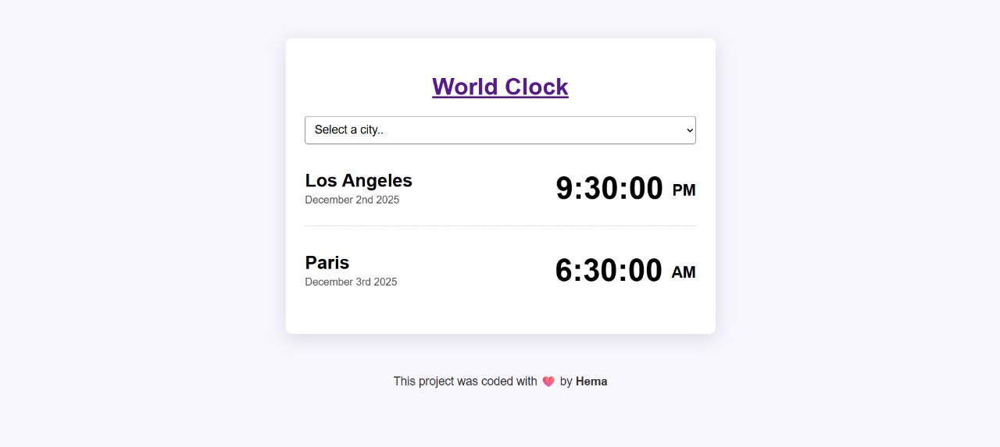

# World Clock

A simple web application to display the current time in different cities.

## How to use

1.  Clone the repository.
2.  Open `index.html` in your web browser.

## Features

- Displays the current time for Los Angeles and Paris by default.
- Select a city from the dropdown to see the current time in that city.
- Option to see the time in your current location.

## Technologies Used

- HTML
- CSS
- JavaScript
- [Moment.js](https://momentjs.com/)
- [moment-timezone](https://momentjs.com/timezone/)

## Screenshot

## Credits

This project was coded with ❤️ by **Hema**.
